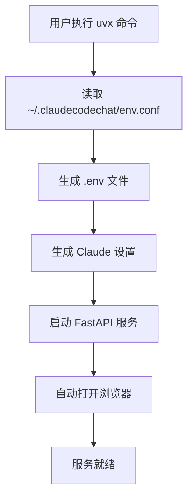

# uvx 部署指南

本文档详细说明了如何使用 uvx 进行一键部署 Claude Code Web Chat 服务。

## 概述

新增的 uvx 部署方式实现了以下目标：

1. **用户配置简化**：用户只需在 `~/.claudecodechat/env.conf` 中配置环境变量
2. **一键启动**：通过 `uvx --from git+https://... claude-code-web-chat` 直接运行
3. **自动配置**：自动根据用户配置生成 `.env` 文件和 Claude 设置
4. **自动启动服务**：自动启动 Web 服务并在浏览器中打开

## 实现细节

### 1. 配置文件结构

用户配置文件位于 `~/.claudecodechat/env.conf`，使用 INI 格式：

```ini
[DEFAULT]
ANTHROPIC_BASE_URL=your_anthropic_base_url_here
ANTHROPIC_AUTH_TOKEN=your_anthropic_auth_token_here
ANTHROPIC_MODEL=claude-4.5-sonnet
# ... 其他配置项
```

### 2. 关键组件

#### a. 环境配置脚本 (`scripts/setup_env.py`)
- 读取 `~/.claudecodechat/env.conf` 配置文件
- 使用 `.env.example` 作为模板生成 `.env` 文件
- 保留注释和格式，只替换配置值

#### b. 主入口脚本 (`claude_code_web_chat/__main__.py`)
- 作为 uvx 的入口点
- 协调整个启动流程：
  1. 调用环境配置设置
  2. 生成 Claude 设置
  3. 启动 FastAPI 服务
  4. 自动打开浏览器

#### c. 包配置 (`pyproject.toml`)
- 定义了包的元数据和依赖关系
- 配置了 `claude-code-web-chat` 命令行入口
- 指定了需要包含的文件和目录

### 3. 执行流程



### 4. 错误处理

- 如果配置文件不存在，显示详细的创建说明
- 如果必需的配置项缺失，列出缺失的项目
- 保留现有的 Claude 设置（非环境变量部分）
- 提供详细的错误信息和解决建议

## 使用方法

### 第一次使用

1. 创建配置目录：
   ```bash
   mkdir -p ~/.claudecodechat
   ```

2. 创建配置文件：
   ```bash
   cat > ~/.claudecodechat/env.conf << 'EOF'
   [DEFAULT]
   ANTHROPIC_BASE_URL=your_anthropic_base_url_here
   ANTHROPIC_AUTH_TOKEN=your_anthropic_auth_token_here
   ANTHROPIC_MODEL=claude-4.5-sonnet
   # ... 其他配置
   EOF
   ```

3. 编辑配置文件，填入真实的配置值

4. 运行服务：
   ```bash
   uvx --from git+https://github.com/lizhouai/claude-code-web-chat.git claude-code-web-chat
   ```

### 后续使用

只需执行步骤 4，系统会自动读取已存在的配置文件。

## 优势

1. **简化部署**：无需手动管理依赖和环境配置
2. **配置集中**：所有配置集中在一个文件中
3. **安全性**：配置文件位于用户主目录，权限更安全
4. **可重复使用**：一次配置，多次使用
5. **自动化**：从配置到启动全程自动化

## 兼容性

- 完全兼容现有的本地开发方式
- 不影响 Docker 部署（未来实现时）
- 保持所有现有 API 和功能不变

## 测试

项目包含了完整的测试脚本 (`scripts/test_uvx_setup.py`)，可以验证：
- 配置文件读取功能
- 环境文件生成功能
- Claude 设置生成功能
- 端到端的设置流程

运行测试：
```bash
python scripts/test_uvx_setup.py
```

## 技术栈

- **配置解析**：使用 Python 的 `configparser` 模块
- **包管理**：使用现代的 `pyproject.toml` 格式
- **依赖管理**：通过 uvx 自动处理
- **进程管理**：使用 `threading` 实现浏览器自动打开
- **错误处理**：详细的异常捕获和用户友好的错误信息